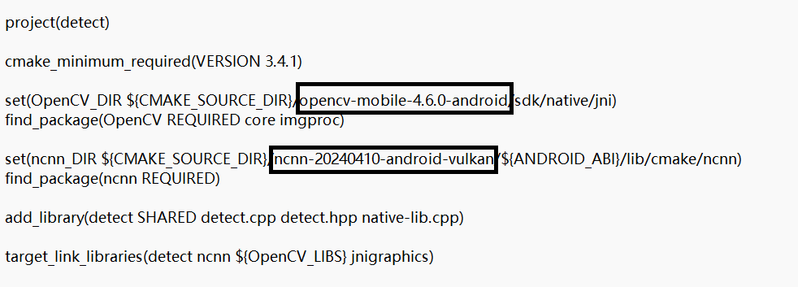

	

This image was generated by [Flux](https://github.com/black-forest-labs/flux), fabulous!
# Tikson

Tikson is an open source image processing APP, currently contains three core functions "LaMa redrawing, intelligent matting, HD amplification", based on the NCNN framework, to achieve a variety of models of pure end-side inference.

About
**Tikson是一款开源的图像处理APP，目前包含三大核心功能“LaMa重绘、智能抠图、高清放大”，基于NCNN框架，实现多种模型的纯端侧推理。**

---

## Download & Build status

https://github.com/Fischer-pixel/Tikson/releases/latest

If you don't want to build from source, from the network location [Baidu Netdisk](https://pan.baidu.com/s/149u__tMBz-DBGQxDgWZ5Vg?pwd=b3jt)(link: https://pan.baidu.com/s/149u__tMBz-DBGQxDgWZ5Vg?pwd=b3jt extraction code: b3jt) download the full amount of the APP (700 MB).

**如果你不想从源代码构建Android项目，可以从[百度网盘](链接: https://pan.baidu.com/s/149u__tMBz-DBGQxDgWZ5Vg?pwd=b3jt 提取码: b3jt)下载全量APP(700MB)。**

1. Download all model to "app/src/main/assets" directory from [release](https://github.com/Fischer-pixel/Tikson/releases/latest).

   **从[release](https://github.com/Fischer-pixel/Tikson/releases/latest)中下载所有模型到"app/src/main/assets"目录中。**

  

2. Download [NCNN-vulkan](https://github.com/Tencent/ncnn/releases/latest), and extract it to "app/src/main/cpp" directory.
    **下载[ncnn-vulkan](https://github.com/Tencent/ncnn/releases/latest)并解压到"app/src/main/cpp"目录下。**

  

3. Download the [opencv-mobile](https://github.com/nihui/opencv-mobile/releases), and extract it into "app/src/main/cpp" directory.
    **下载[opencv-mobile](https://github.com/nihui/opencv-mobile/releases)并解压到"app/src/main/cpp"目录下。**

  

4. Change the opencv-mobile and NCNN version num to your own download version in "app/src/main/cpp/CMakeLists.txt".
    **更改"app/src/main/cpp/CMakeLists.txt"中opencv-mobile，ncnn为你自己下载的版本号。**
    

---

## References

1. [ncnn](https://github.com/Tencent/ncnn)
2. [opencv-mobile](https://github.com/nihui/opencv-mobile)
3. [Doodle](https://github.com/1993hzw/Doodle)
4. [Real-ESRGAN](https://github.com/xinntao/Real-ESRGAN)
5. [Real-ESRGAN-ncnn-vulkan](https://github.com/xinntao/Real-ESRGAN-ncnn-vulkan)
6. [rembg](https://github.com/danielgatis/rembg)
7. [u2net](https://github.com/xuebinqin/U-2-Net)
8. [lama](https://github.com/advimman/lama)
9. [iopaint](https://github.com/Sanster/IOPaint)
10. [pytorch](https://pytorch.org/mobile)
---

to be continued...
**未完待续。。。**